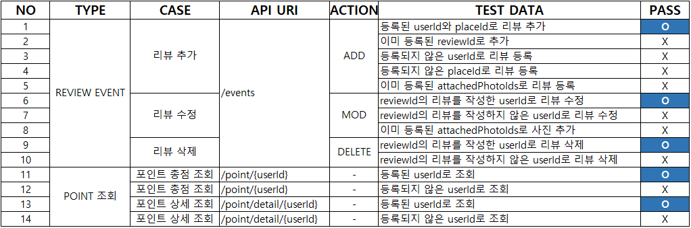

# Triple Back-end 사전 과제

트리플 여행자 클럽 마일리지 서비스 개발

## 기술스택
* JAVA 17

* SPRING BOOT 2.7.1

* GRADLE 7.4.1

* MySQL 8.0.29

* JPA


## 실행방법

#### **jar 파일 경로**
\TripleTravelersMileage\build\libs\TripleTravelersMileage-0.0.1-SNAPSHOT.jar

```bash
cd {target}

java -jar TripleTravelersMileage-0.0.1-SNAPSHOT.jar
```

## 테스트 케이스



## TRIPLE API 명세서

1. 리뷰 이벤트 API 

|**METHOD**|**요청 URL**|**DESCRIPTION**|**출력 포맷**|
|:--------:|------------|---------------|:---------:|
|POST|http://localhost:8080/events|리뷰 추가, 수정, 삭제 이벤트 발생시 포인트 적립/차감|JSON|

2. 유저 토탈 포인트 조회 API

|**METHOD**|**요청 URL**|**DESCRIPTION**|**출력 포맷**|
|:--------:|------------|---------------|:---------:|
|GET|http://localhost:8080/point/{userId}|특정 유저의 현재 누적 포인트 조회|JSON|

3. 유저 포인트 내역 조회 API

|**METHOD**|**요청 URL**|**DESCRIPTION**|**출력 포맷**|
|:--------:|-------|---------------|:---------:|
|GET|http://localhost:8080/point/detail/{userId}|특정 유저의 포인트 상세 내역 조회|JSON|

## DB 자료 경로
* #### 테이블 생성 DDL 및 테스트 데이터

```text
  \TripleTravelersMileage\src\main\resources\DB\TripleDB.sql
```

* #### E-R Diagram

```text
  \TripleTravelersMileage\src\main\resources\DB\TripleERD.PNG
```

